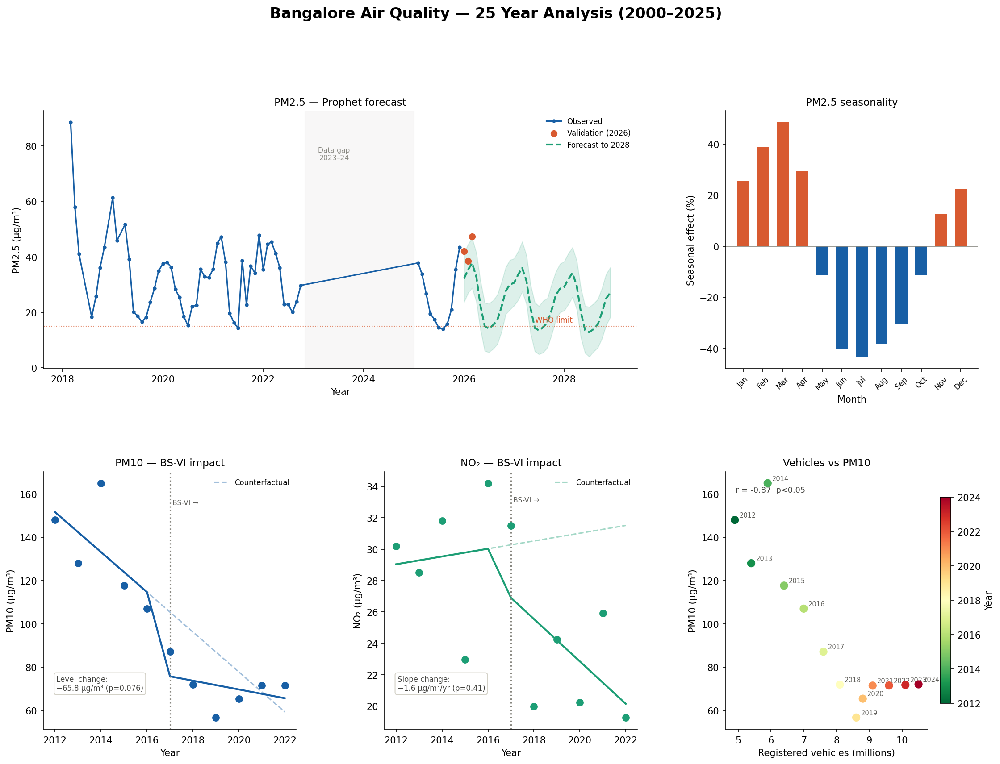

## Bangalore Air Quality Analysis (2000–2025)

A 25-year analysis of urban air pollution in Bangalore, India, combining 
ground-station sensor data, NASA satellite reanalysis, and government 
monitoring reports to identify trends, causes, and policy impacts.

## Key findings

- **PM2.5 is declining** — a downward trend from ~40 µg/m³ (2018) to a 
  projected ~20 µg/m³ by 2028, but remains 2× above the WHO guideline of 15 µg/m³
- **BS-VI fuel policy (2017) associated with a −65.8 µg/m³ drop in PM10** 
  — the largest single structural break in the 25-year record (p=0.076)
- **Vehicle growth paradox** — registered vehicles grew 3× (2012–2024) yet 
  PM10 fell 52%, suggesting emission quality improvements outpaced volume growth 
  (r=−0.87, p<0.05)
- **Monsoon drives a 90% seasonal swing** — PM2.5 peaks in March (+47%) 
  and troughs in July (−43%), meaning weather explains nearly half of 
  year-to-year variation
- **NO₂ shows no significant policy response** — consistent with traffic 
  volume growth offsetting per-vehicle emission reductions

## Summary figure

## Data sources

| Source | Coverage | Pollutants | Access |
|--------|----------|------------|--------|
| OpenAQ API (CPCB stations) | 2018–2025 | PM2.5, PM10, NO₂, SO₂, O₃, CO | Free API |
| NASA MERRA-2 (M2T1NXAER) | 2000–2025 | SO₂ proxy | Free (Earthdata account) |
| KSPCB Annual Reports | 2012–2017 | PM10, NO₂, SO₂ | PDF extraction |
| VAHAN vehicle registry | 2005–2024 | Registered vehicles | Portal download |

### Known data gaps and limitations
- **2023–2024**: CPCB stopped reporting to OpenAQ — values interpolated 
  and flagged in dataset
- **MERRA-2 PM2.5**: R²=0.07 against ground truth — rejected as unreliable 
  for Bangalore; SO₂ proxy retained (R²=0.66)
- **Pre-2012**: No ground-station PM2.5 or PM10 data available for Bangalore
- **SO₂ cross-source inconsistency**: MERRA-2, KSPCB, and OpenAQ values 
  show incompatible baselines — treated as descriptive only

---

## Methodology

### 1. Data pipeline
- **OpenAQ**: Paginated REST API fetch across 8 Bangalore stations 
  (Peenya, Silk Board, Jayanagar, BTM Layout, Hebbal, Bapuji Nagar, 
  Hombegowda Nagar, City Railway Station). Hourly readings resampled 
  to annual means. Years with <40% hourly coverage flagged as unreliable.
- **MERRA-2**: Monthly NetCDF4 files extracted for Bangalore bounding box 
  (12.8–13.1°N, 77.5–77.7°E) using `xarray`. Four representative months 
  per year (Jan, Apr, Jul, Oct) averaged to annual means. Bias-corrected 
  against OpenAQ overlap years (2018–2022) via linear regression.
- **KSPCB**: Annual mean tables extracted from PDF reports using 
  `pdfplumber` and OCR (`pytesseract`) for scanned pages.
- **VAHAN**: Registered vehicle counts by year for Bangalore Urban district.

### 2. Analysis
- **Trend analysis**: Mann-Kendall test + Sen's slope for monotonic trends
- **Forecasting**: Facebook Prophet with multiplicative seasonality 
  (Fourier order=3), trained on 2018–2022, validated on 2026
- **Causal inference**: Interrupted time series regression around BS-VI 
  fuel policy introduction (2017)
  - Model: `pollution = β₀ + β₁·time + β₂·post + β₃·time×post`
  - `post` = 1 after 2017, captures immediate level change
  - `time×post` captures slope change after intervention
- **Correlation**: Pearson r between annual vehicle registrations and 
  pollution levels

---
