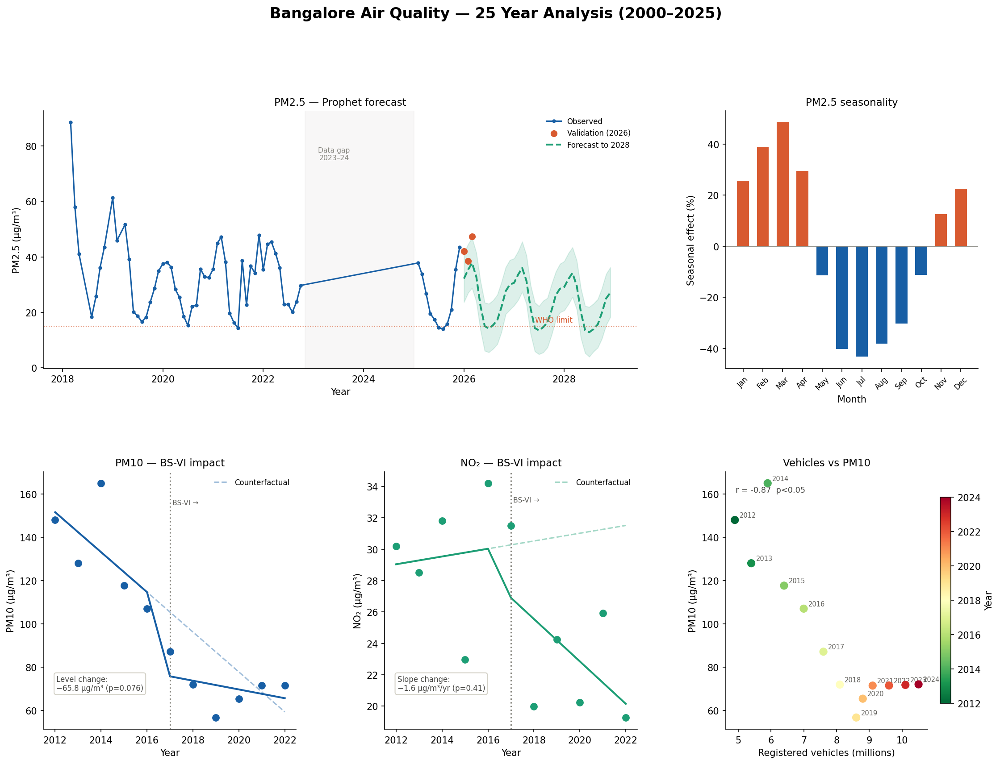

# Bangalore Air Quality Analysis (2000–2025)

A 25-year analysis of urban air pollution in Bangalore, India, combining 
ground-station sensor data, NASA satellite reanalysis, and government 
monitoring reports to identify trends, causes, and policy impacts.

---

## Key findings

- **PM2.5 is declining** — a downward trend from ~40 µg/m³ (2018) to a 
  projected ~20 µg/m³ (95% CI: 12–28) by 2028, but remains 2× above 
  the WHO annual guideline of 15 µg/m³
- **PM10 shows a large drop coinciding with BS-IV (2017)** — the ITS 
  model estimates a −65.8 µg/m³ level change at 2017, though this does 
  not reach statistical significance (p=0.076, n=11) and should be 
  treated as exploratory
- **Vehicle growth paradox** — registered vehicles grew 3× (2012–2024) 
  yet PM10 fell 52% over the same period (r=−0.87, n=12); note both 
  series share a common time trend and causation cannot be inferred 
  from this correlation alone
- **Monsoon drives a 90% seasonal swing** — PM2.5 peaks in March (+47%) 
  and troughs in July (−43%), meaning weather explains nearly half of 
  year-to-year variation
- **NO₂ shows no significant policy response** — consistent with traffic 
  volume growth offsetting per-vehicle emission reductions

---

## Summary figure

---

## Data sources

| Source | Coverage | Pollutants | Access |
|--------|----------|------------|--------|
| OpenAQ API (CPCB stations) | 2018–2025 | PM2.5, PM10, NO₂, SO₂, O₃, CO | Free API |
| NASA MERRA-2 (M2T1NXAER) | 2000–2025 | SO₂ proxy | Free (Earthdata account) |
| KSPCB Annual Reports | 2012–2017 | PM10, NO₂, SO₂ | PDF extraction |
| VAHAN vehicle registry | 2005–2024 | Registered vehicles | Portal download |

---

## Known limitations

| Issue | Detail |
|-------|--------|
| 2023–2024 data gap | CPCB stopped reporting to OpenAQ — values interpolated and flagged |
| MERRA-2 PM2.5 rejected | R²=0.07 against ground truth — unreliable for Bangalore; SO₂ proxy retained (R²=0.66) |
| ITS underpowered | n=11 annual points, 4 parameters — p-values should be interpreted cautiously |
| 2014 PM10 outlier | 165 µg/m³ likely inflates the pre-intervention mean and the estimated level change |
| Ecological fallacy risk | Vehicle-pollution correlation (r=−0.87) reflects shared time trend; not causal |
| SO₂ cross-source inconsistency | MERRA-2, KSPCB, and OpenAQ values show incompatible baselines — descriptive only |
| Prophet extrapolation | 3-year forecast beyond training window carries wide uncertainty (95% CI: 12–28 µg/m³) |
| BS-IV not BS-VI | The 2017 intervention is BS-IV (national rollout April 2017). BS-VI was implemented in April 2020 and is outside this analysis window |

---

## Methodology

### 1. Data pipeline

- **OpenAQ**: Paginated REST API fetch across 8 Bangalore stations 
  (Peenya, Silk Board, Jayanagar, BTM Layout, Hebbal, Bapuji Nagar, 
  Hombegowda Nagar, City Railway Station). Hourly readings resampled 
  to annual means. Years with <40% hourly coverage flagged as unreliable.
- **MERRA-2**: Monthly NetCDF4 files extracted for Bangalore bounding box 
  (12.8–13.1°N, 77.5–77.7°E) using `xarray`. Four representative months 
  per year (Jan, Apr, Jul, Oct) averaged to annual means. Bias-corrected 
  against OpenAQ overlap years (2018–2022) via linear regression. PM2.5 
  proxy rejected after validation (R²=0.07).
- **KSPCB**: Annual mean tables extracted from PDF reports using 
  `pdfplumber` and OCR (`pytesseract`) for scanned pages.
- **VAHAN**: Registered vehicle counts by year for Bangalore Urban district.

### 2. Analysis

**Trend analysis**
- Mann-Kendall test + Sen's slope for monotonic trends across all pollutants

**Forecasting**
- Facebook Prophet with multiplicative seasonality (Fourier order=3)
- Trained on monthly PM2.5 data 2018–2022
- Out-of-sample evaluation on 3 months of early 2026 data
- Note: 3-year extrapolation to 2028 carries substantial uncertainty

**Causal inference — Interrupted Time Series**
- Intervention point: BS-IV national rollout, April 2017
- Model: `pollution = β₀ + β₁·time + β₂·post + β₃·time×post`
- `post` = 1 from 2017 onwards (immediate level change)
- `time×post` = slope change after intervention
- Caveat: n=11 annual points gives very low statistical power; 
  results are exploratory only

**Correlation analysis**
- Pearson r between annual vehicle registrations and pollution levels
- Caveat: both series trend over time; partial correlation 
  controlling for year would be a more rigorous test

---

## Author
Data covers Bangalore Urban district, Karnataka, India
